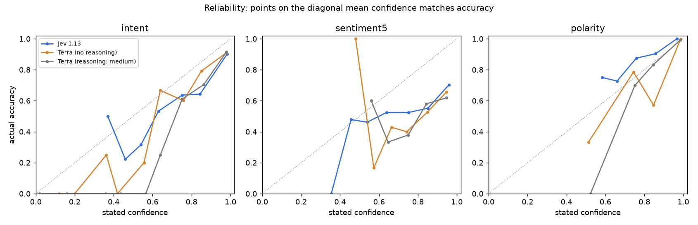
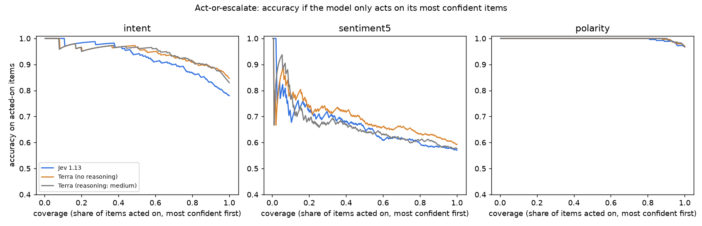

# jev-eval

An independent check of [TypeSafe](https://typesafe.ai)'s Jev, a "System One" model that
returns typed decisions with probabilities, against OpenAI's GPT-5.6 Terra. It uses three
public datasets with real ground-truth labels.

TypeSafe's own evaluation measures how often Jev agrees with the average of GPT-6 Astra and
Claude Fable 5.1, on workflows its own team wrote. This repo measures accuracy against the
dataset labels instead. It also checks whether the confidence each model reports is honest,
and times and prices every call.

Run on 2026-09-17: `jev-1.13.0` (via `jev-latest`) and `openai/gpt-5.6-terra` (via OpenRouter,
served by OpenAI). 300 items per task, 2,700 scored calls plus a 900-call Jev rerun.

## Results in one screen

| | intent (77-way) | sentiment (5 levels) | polarity (yes/no) |
|---|---|---|---|
| **Accuracy** Jev / Terra | **0.780** / 0.847 | 0.570 / 0.593 | 0.970 / 0.970 |
| 95% CI overlap | barely | yes | yes |
| **ECE** (calibration error, lower is better) Jev / Terra | 0.110 / **0.081** | **0.200** / 0.303 | 0.042 / **0.020** |
| **p50 latency** Jev / Terra | 0.20 s / 1.04 s | 0.19 s / 1.06 s | 0.20 s / 1.04 s |
| **Cost per 1k calls** Jev / Terra | $0.040 / $2.02 | $0.014 / $0.64 | $0.021 / $0.85 |

Full tables, threshold coverage and the reasoning-Terra variant are in
[`results/summary.md`](results/summary.md).

**What held up**
- **Speed and cost are real, but smaller than advertised.** Jev was about **5x faster** at the
  median and **41–50x cheaper per call**. That is far below the "193.6x faster, 444.6x cheaper"
  headline, which TypeSafe itself describes as the high end, measured on its own workflows.
- **Type safety.** Every one of Jev's 1,800 responses parsed into a valid option. So did
  Terra's 1,800, because strict JSON-schema output also guarantees this.
- **Easy tasks are a tie.** On binary polarity, both models scored 0.970.

**What didn't**
- **Accuracy is not at parity on the hard task.** On 77-way Banking77 intent, Jev was
  6.7 points behind Terra, and the 95% intervals only just overlap.
- **Calibration is mixed, not better.** Jev was better calibrated on 5-level sentiment, where
  every model is overconfident. It was worse than Terra on intent and polarity. On polarity it is
  *under*confident: on the 62 items where it reports 0.5–0.9, it is right 73–90% of the time.
  On intent it is overconfident at the top: at an average of 0.98 confidence, it is right 90% of the time.
- **Confidence isn't a better escalation signal.** AUROC (how well confidence separates
  right answers from wrong ones) was 0.83 / 0.61 / 0.94 for Jev and 0.81 / 0.64 / 0.96 for Terra.
- **Jev is not deterministic.** Re-sending identical inputs changed the chosen label for 1.7% of
  intent items and 3.3% of sentiment items (0% on polarity).
- **Jev bills more tokens for the same text.** It averaged 340 input tokens vs Terra's 162 on
  the same sentences, and 502 vs 311 on the same reviews. That overhead is why the per-call
  saving is smaller than the per-token price gap (47.6x).

**About TypeSafe's reasoning comparison:** its 8.6 s Terra figure used reasoning. Here, Terra
on OpenRouter's default used 0 reasoning tokens. With `reasoning.effort = "medium"` it used
only 4–17 reasoning tokens per call and still returned in about 1 s. Accuracy did not improve.
On short classification inputs, "Terra with reasoning" is not the slow baseline the headline
implies.





## Method

| task | data | Jev question | Terra output |
|---|---|---|---|
| `intent` | Banking77 test (`mteb/banking77` mirror), 300 items, 3–4 per class | `choice`, 77 options | `{label, confidence}` |
| `sentiment5` | SST-5 test (`SetFit/sst5`), 60 per level | `score`, 5 ordered levels | `{label, confidence}` |
| `polarity` | IMDB test, reviews ≤300 words, 150 per class | `noul` (yes/no) | `{label, confidence}` |

- Samples are stratified and seeded (`evaljev/data.py`) and committed in `data/`.
- Both models get the same instruction sentence and the same option names. Terra uses a
  strict JSON schema whose `label` is an enum of the options.
- **Confidence** means the probability of the top label. For Jev this comes from its returned
  distribution (not its derived `confidence` field, which is a certainty statistic, not a probability). For
  Terra it is the number the model states.
- **Latency** is the wall-clock time of the successful HTTP request, measured the same way for
  both. It excludes client-side queueing.
- **Cost** for Jev is `input_tokens × $0.042/M`, since output is free. For Terra it is
  OpenRouter's reported `usage.cost`.
- Raw per-item records, including request ids and raw answers, are in `results/<task>/<model>.jsonl`.

## Caveats

- **Contamination.** All three datasets are public and old. Either model may have seen them.
- **Stated vs native probabilities.** Terra's confidence is verbalized and clusters at 0.98–0.99.
  Jev's is a real distribution. That is a structural advantage for Jev on calibration, and it
  still did not win on two of three tasks.
- **One run, one place, one day.** Latency was measured from a single client machine,
  and rate limits and load change. TypeSafe notes its service is based on the US West Coast.
- **OpenRouter adds a hop** for Terra, so direct OpenAI access may be somewhat faster.
- **No prompt tuning** for either model. TypeSafe recommends decomposing broad questions and
  writing per-option criteria. The 77 intent options were given bare names with no descriptions, which may affect the
  two models differently; this was not tested.
- **n = 300 per task.** Differences under about 5 points are within noise; see the CIs.
- **Banking77 mirror.** 3,076 test rows vs 3,080 in the original.

## Rerun it

```bash
cp .env.example .env        # fill in TYPESAFE_API_KEY and OPENROUTER_API_KEY
uv sync
uv run python -m evaljev.data                                 # rebuild samples (optional; committed)
uv run python -m evaljev.run --model jev --n 300
uv run python -m evaljev.run --model terra --n 300 --cap 10  # stops at $10 of OpenRouter spend
uv run python -m evaljev.run --model terra-reason --n 300 --cap 10
uv run python -m evaljev.run --model jev --n 300 --tag rerun # determinism check
uv run python -m evaljev.report                               # results/summary.md + plots
uv run pytest
```

Runs resume: already-scored ids are skipped, and failed ones are retried. Delete
`results/<task>/<model>.jsonl` to start that pair over. The full run cost $0.045 on Jev
(including the rerun) and $2.10 on OpenRouter.

