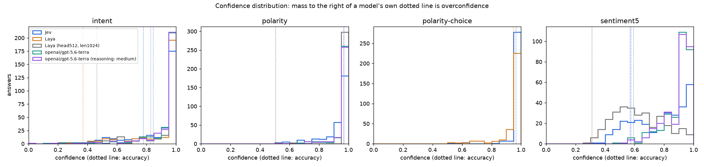

# jev-eval

Benchmark [TypeSafe Jev](https://typesafe.ai) against any OpenRouter model or a local checkpoint on labelled classification data: accuracy, calibration, confidence distribution, latency, cost. Ships five tasks; the results below are Jev, GPT-5.6 Terra, and three open Jev-shaped models.

## Results

300 items per task. `jev-1.13.0`; `openai/gpt-5.6-terra` via OpenRouter; [Laya](https://huggingface.co/convaiinnovations/laya) 421M, [open-jev](https://huggingface.co/com-kotobalabs/open-jev-deberta-v3-large) 435M and [Kev-0.8B](https://huggingface.co/jaredpalmer/kev-0.8b) run locally on an M-series GPU.

**Accuracy**

| task | options | Jev | Terra | open-jev | Kev-0.8B | Laya |
|---|---|---|---|---|---|---|
| clinc (out-of-sample) | 151 | **0.897** | — | 0.610 | 0.643 | 0.497 |
| intent (Banking77) | 77 | 0.780 | 0.847 | **0.873** | 0.770 | 0.370 |
| sentiment5 (SST-5) | 5 | 0.570 | **0.593** | 0.560 | 0.510 | 0.310 |
| polarity (IMDB) as `noul` | 2 | **0.970** | **0.970** | 0.957 | 0.953 | 0.507 |
| polarity as `choice` | 2 | **0.967** | — | 0.963 | 0.950 | 0.947 |

**Calibration (ECE, lower better) and p50 latency**

| task | Jev | Terra | open-jev | Kev-0.8B | Laya |
|---|---|---|---|---|---|
| clinc | **0.039** / 0.17 s | — | 0.072 / 0.43 s | 0.260 / 0.87 s | 0.471 / **0.16 s** |
| intent | 0.110 / 0.20 s | 0.081 / 1.04 s | **0.047** / 0.27 s | 0.146 / 0.67 s | 0.520 / **0.10 s** |
| sentiment5 | 0.200 / 0.19 s | 0.303 / 1.06 s | **0.052** / 0.07 s | 0.110 / 0.13 s | 0.317 / **0.04 s** |
| polarity | 0.042 / 0.20 s | **0.020** / 1.04 s | 0.036 / 0.17 s | 0.030 / 0.37 s | 0.496 / **0.08 s** |

- **Training on the benchmark decides the winner.** open-jev lists `mteb/banking77` and `SetFit/sst5` as training data and beats Jev on Banking77, 0.873 against 0.780. On CLINC150 — the same job, intent classification, but in no clone's training list — it is 28.7 points behind, 0.610 against 0.897. Kev, which lists the same two datasets, shows the same reversal: 0.770 on Banking77, 0.643 on CLINC. Jev *gains* on CLINC. Quote either number alone and you get the opposite story.
- **Only Jev is flat in option count.** From 2 to 151 options its p50 moves 0.17 to 0.20 s. Every local model degrades: Laya 0.04 → 0.16 s, open-jev 0.07 → 0.43 s, Kev 0.13 → 0.87 s. Jev scores the whole option set in one pass; its documented ceiling is 255.
- **open-jev is the best-calibrated model here**, Jev and Terra included, on four of five tasks, at 435M parameters and no cost.
- **Laya's `noul` fails on one phrasing, not on the primitive.** "Is this movie review positive?" returns 0.0 on 100% of reviews at near-total confidence; "Did the reviewer like the movie?" scores 0.91 on the same items, and the same question as a `choice` scores 0.947. Jev is unmoved by the wording, 0.94 against 0.93. No other model here shows it.
- **Kev needed no adapter.** It serves TypeSafe's own `/v1/systemone` contract, so the Jev runner points at `localhost`.

Full tables, confidence distributions and reliability diagrams: [`results/summary.md`](results/summary.md).



## Run

```bash
cp .env.example .env        # TYPESAFE_API_KEY, OPENROUTER_API_KEY
uv sync
uv run python -m evaljev.run --model jev
uv run python -m evaljev.run --model openai/gpt-5.6-terra
uv run python -m evaljev.run --model openai/gpt-5.6-terra --reasoning medium
uv run python -m evaljev.run --model jev --tag rerun     # determinism check
uv run python -m evaljev.report
uv run pytest
```

Local checkpoints need the extra:

```bash
uv sync --extra local
HF_HUB_DISABLE_XET=1 uv run python -m evaljev.run --model laya
HF_HUB_DISABLE_XET=1 uv run python -m evaljev.run --model "laya@head=512,len=1024"
HF_HUB_DISABLE_XET=1 uv run python -m evaljev.run --model open-jev
```

Any server speaking the System One contract is benchable by URL. For Kev, start its server and point at it:

```bash
git clone https://github.com/jaredpalmer/kev && cd kev && uv sync --extra serve
KEV_DTYPE=bf16 uv run --extra serve python -m kev.serve --run jaredpalmer/kev-0.8b --port 8009
KEV_URL=http://127.0.0.1:8009 uv run python -m evaljev.run --model kev
```

`evaljev.serve` does the reverse, putting a local checkpoint behind the same contract so any client that talks to TypeSafe can talk to it:

```bash
uv sync --extra serve
HF_HUB_DISABLE_XET=1 uv run --extra serve python -m evaljev.serve --model laya --port 8010
```

`--model` is `jev`, any OpenRouter model id, `laya[:subfolder][@key=value,...]`, `open-jev`, or `kev`. `--reasoning` sets effort where supported. `--cap` stops at that many dollars of OpenRouter spend; local models are free and never capped. Runs resume; delete `results/<task>/<model>.jsonl` to redo a pair.

A task is up to three files in `data/`:

```
<name>.jsonl         {"id", "text", "label"} per line
<name>.labels.json   the label list; for noul [no, yes]; optional for choice
<name>.task.json     {"kind": "choice"|"score"|"noul", "instructions": ..., "criteria": ... (noul),
                      "data": "<other task>" to reuse its items instead of copying them}
```

## Notes

- Training data as each model's card lists it. open-jev: Banking77, SST-5, BoolQ. Kev: Banking77, SST-5, BoolQ, AG News, MultiNLI, Yelp. Laya: not listed. So `intent` and `sentiment5` are in-sample for two of the clones; `clinc` is out-of-sample for all, and `polarity` is in no card's list.
- Metrics are in `evaljev/metrics.py` and unit-tested. Confidence is the probability of the chosen label: the returned distribution for Jev, Laya, open-jev and Kev, the stated number for Terra.
- Latency is the wall-clock time of one successful call, same clock for every model. API models include the network; local models are the forward pass with the model resident, measured after warm-up. They are not the same quantity.
- Cost is `input_tokens × $0.042/M` for Jev (output free), OpenRouter's billed `usage.cost` for API models, zero for local ones.
- Local models run one call at a time so latency is uncontended; API models run 8 or 16 in flight.
- Laya's checkpoint is 808 MB. The Hugging Face xet transfer stalled at zero bytes here; `HF_HUB_DISABLE_XET=1` uses the classic path.
- Not benchable here: `Bespoke-Nimble-9B` requires a CUDA GPU and caps at 26 choices per field, so the 77- and 151-option tasks are impossible for it; DiffusionGemmaJev and Jevlike have no published weights.
- Caveats: the datasets are public and old; Terra's confidence is self-reported; one run from one machine; no prompt tuning; at n = 300 differences under about 5 points are noise; the Banking77 mirror has 3,076 test rows against 3,080 in the original.
